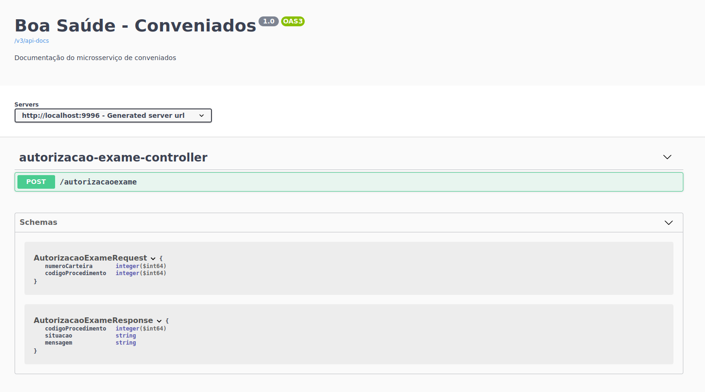

# Conveniados

Microsserviço de conveniados criado para utilização na POC de arquitetura da operadora Boa Saúde - TCC de Arquitetura de dados da PUC Minas Virtual

## Tecnologias utilizadas:

- Java - Linguagem de programação utilizada
- Webflux - Módulo inserido no framework que possibilita aplicações web com Spring trabalhar de forma reativa
- Spring Boot - Framework utilizado para desenvolvimento de serviços com java
- Spotless - Identação de código e remoção de imports não utilizados
- Swagger - Documentação da API
- Junit - Testes unitários
- Mockito - Framework de testes unitários para realização de mock
